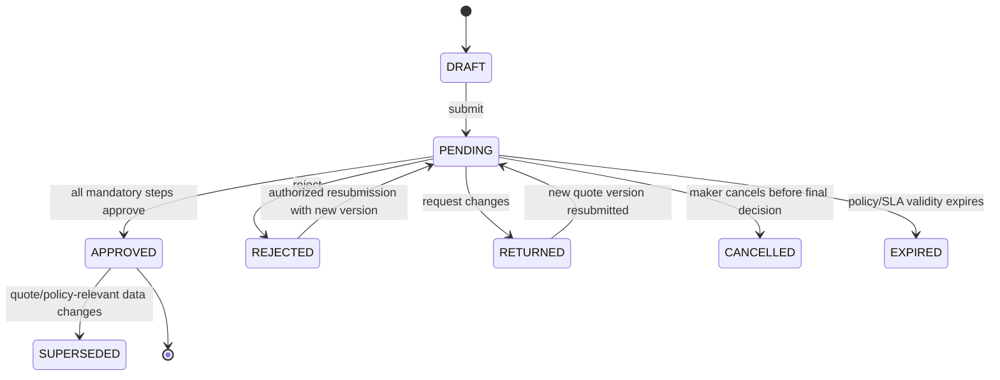

# NTOP Approval Workflow

| Metadata | Value |
|---|---|
| Status | Draft for Review |
| Version | 0.1 |
| Owner | Pricing and Commercial Governance |
| Reviewers | Finance, Sales Director, Legal, Security, Auditor, Product, QA |
| Last Updated | 2026-07-11 |
| Related Documents | [Requirements](product-requirements.md), [Domain](domain-model.md), [Permissions](roles-and-permissions.md), [Opportunity](opportunity-workflow.md), [API](api-design.md) |
| Assumptions | Policy versioned; maker-checker mandatory for exceptional commercial terms |
| Open Decisions | Monetary/discount/margin thresholds; exact authority chain; delegation and SLA values; legal approval triggers |

## 1. Policy inputs

Routing พิจารณา quote total, discount, gross margin, product/category, customer segment, opportunity risk, non-standard terms, partner cost, contract duration และ exception type Policy evaluator คืน required steps + execution mode + SLA โดย snapshot policy version และ input values ไว้กับ request (BR-004, FR-007)

ค่าตัวเลขทุก threshold เป็น `Open Decision OD-003`; implementation ห้าม hard-code จน Commercial Governance อนุมัติ version 1

## 2. States

Decision records append-only; request status เป็นผล derivation จาก step decisions ห้าม overwrite history

## 3. Routing and execution

- Sequential เมื่อ step หลังต้องพึ่ง decision ก่อนหน้า; parallel สำหรับ independent Pricing/Legal/Technical checks
- Reject ที่ mandatory step ปิด request; Return ส่งกลับ maker พร้อม required changes
- Resubmit ต้องอ้าง quote version ใหม่หรือพิสูจน์ว่า approved fields ไม่เปลี่ยน
- Policy-relevant change หลัง Approved ทำ approval `SUPERSEDED` และ reroute
- Approver assignment ใช้ role + organization + authority at submission; delegation snapshot ณ เวลา decision
- ไม่มี eligible approver ให้ status pending-escalation และ alert owner; ห้าม auto-approve

## 4. Authority and SoD

- Maker/quote editor ห้าม approve mandatory step ของ quote ตนเอง
- Approver ต้อง active, MFA-valid, within monetary/segment scope และไม่มี conflict flag
- Delegation จำกัดช่วงเวลา/scope/authority และ audited; expired delegation ถูก deny
- Override ใช้เฉพาะ named exceptional role + second approval + reason/evidence; Admin ไม่มี override โดย role alone
- Bulk approval ปิดโดย default; หากเปิดต้อง evaluate แต่ละ request และสร้าง decision ต่อรายการ (SEC-002, COMP-001)

## 5. Notifications and SLA

เมื่อ assign/remind/escalate/decide ส่ง in-app notification ผ่าน queue แบบ idempotent SLA clock ใช้ business calendar ที่อนุมัติ (Open Decision) ระบบเตือนก่อน breach และ escalate ไป role owner; outage ไม่เปลี่ยนผล approval และ replay ได้ (FR-012, INT-003)

## 6. Immutable evidence

เก็บ approval request ID, quote/version hash, policy/version, evaluated inputs, step sequence, assigned/delegated approver, decision, comment, timestamp, actor identity/scope, MFA assurance (ไม่เก็บ secret), correlation ID และ document references Auditor อ่านได้แต่แก้ไม่ได้

## 7. Integration fallback

หาก external approval/finance service ยังไม่มี contract ให้ NTOP เป็น workflow record และส่ง controlled package/manual reference เมื่อ adapter ล่ม request คง `PENDING_EXTERNAL` พร้อม owner/SLA; operator บันทึก external decision reference แล้ว second-person verify และ reconcile (BR-005, INT-001–INT-004)

## 8. Acceptance scenarios

- Maker approve quote ตนเองถูก deny
- Approver เกิน authority/หมด delegation ถูก deny
- Parallel steps complete แล้ว final status deterministic
- Quote change หลัง Approved ทำ status Superseded และสร้าง route ใหม่
- Duplicate decision key ไม่สร้าง decision ซ้ำ
- Queue/email outage ไม่สูญ assignment และ replay notification ได้
- ทุก approved/rejected request reconstruct policy/input/actor evidence ได้

