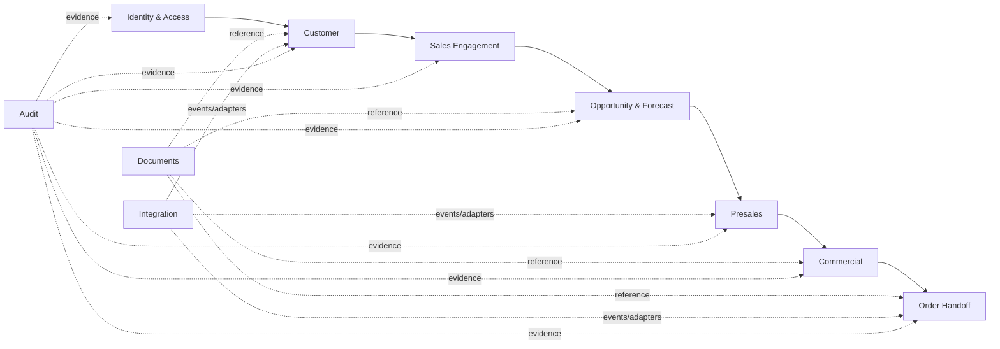
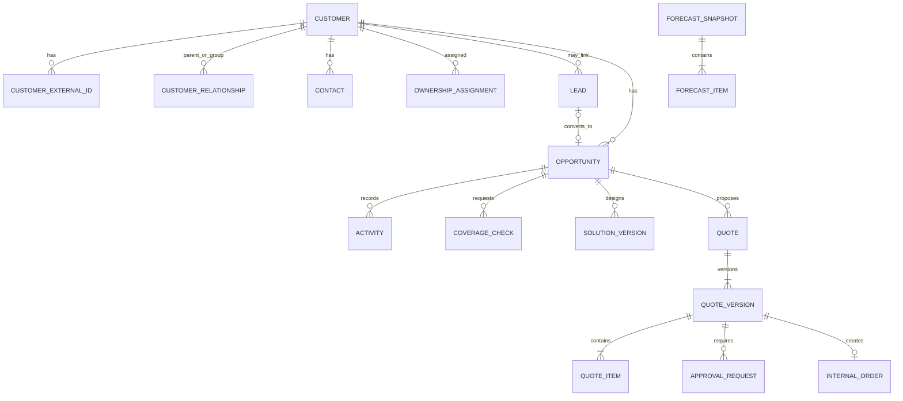

# NTOP Domain Model

| Metadata | Value |
|---|---|
| Status | Draft for Review |
| Version | 0.1 |
| Owner | Domain Architecture / Product |
| Reviewers | Sales, Customer Data, Presales, Pricing, Order Operations, Integration, QA |
| Last Updated | 2026-07-11 |
| Related Documents | [Requirements](product-requirements.md), [Database](database-design.md), [API](api-design.md), [Opportunity Workflow](opportunity-workflow.md), [Approval Workflow](approval-workflow.md) |
| Assumptions | Customer และ Opportunity ใช้ stable internal IDs; cross-context reference ด้วย ID/event |
| Open Decisions | Customer duplicate/merge authority; account hierarchy cardinality; policy thresholds; document classification |

## 1. Bounded contexts

| Context | Ownership | Aggregate roots | Responsibilities |
|---|---|---|---|
| Identity & Access | Security/Admin | User, RoleAssignment, OrganizationUnit | account lifecycle, scopes, sessions, MFA |
| Customer | Customer Data Owner | Customer, CustomerGroup | legal/account identity, hierarchy, contacts, ownership, external IDs |
| Sales Engagement | Sales Operations | Lead, Activity | qualification, conversion, interactions, reminders |
| Opportunity & Forecast | Sales Director | Opportunity, ForecastSnapshot | stage governance, pipeline, historical forecast |
| Presales | Presales/Coverage | Product, CoverageCheck, SolutionDesign | catalog, feasibility, cost/risk assumptions |
| Commercial | Pricing Owner | Quote, ApprovalRequest | quote versions, pricing, margin, decisions |
| Order Handoff | Order Operations | InternalOrder | handoff package, references, acknowledgement/rework |
| Documents | Records Owner | Document | metadata, access, lifecycle, object reference |
| Integration | Integration Owner | IntegrationJob, ReconciliationRun | adapter delivery, inbox/outbox, reconciliation |
| Audit | Auditor/Security | AuditEvent | immutable evidence and retrieval |

## 2. Core entities and invariants

- **Customer:** stable `customerId`; status, segment และ active owner; external ID unique ภายใน source; hierarchy ห้ามเกิด cycle; merge ต้องเก็บ aliases/history (FR-001, DATA-001)
- **Contact:** อยู่ภายใต้ Customer; sensitive fields แสดงตาม scope; primary contact ได้ไม่เกินหนึ่งต่อ contact purpose
- **Lead:** ต้องมี source/status/owner; convert ครั้งเดียวแบบ idempotent; duplicate warning ต้องถูก resolve/override พร้อม reason (FR-002)
- **Activity:** owner + subject/type; ผูก Customer หรือ Opportunity อย่างน้อยหนึ่งเมื่อเป็น sales interaction (FR-003)
- **Opportunity:** อยู่ภายใต้ Customer และมี owner; transition ต้องผ่าน [workflow](opportunity-workflow.md); Won/Lost ต้องมี close date/reason; commercial state เปลี่ยนผ่าน application service เท่านั้น (FR-004)
- **CoverageCheck/SolutionDesign:** result/version ที่ quote อ้างถึงต้อง immutable; confirmed cost ต้องมี timestamp/responder
- **Quote:** versioned aggregate; item totals, discount, margin และ currency deterministic; version ที่ submit แล้วแก้ตรงๆ ไม่ได้ ต้อง clone/new version (FR-006)
- **ApprovalRequest:** snapshot policy + quote version; approver ห้ามเป็น maker เมื่อ policy กำหนด; decision append-only (FR-007, COMP-001)
- **InternalOrder:** สร้างจาก accepted/approved quote version เท่านั้น; handoff package versioned; external references unique ต่อ target system (FR-008)
- **ForecastSnapshot:** immutable และอ้าง source cutoff/timezone/formula version (DATA-004)

## 3. Core relationship model

## 4. Lifecycle events

`CustomerCreated`, `CustomerMerged`, `OwnershipAssigned`, `LeadQualified`, `LeadConverted`, `OpportunityStageChanged`, `CoverageConfirmed`, `SolutionVersionApproved`, `QuoteSubmitted`, `ApprovalDecided`, `QuoteAccepted`, `InternalOrderCreated`, `HandoffAcknowledged`, `ForecastSnapshotCreated`

Event envelope ใช้ contract ใน [api-design.md](api-design.md) และ publish ผ่าน outbox Cross-context consumer ต้อง idempotent; event ไม่อนุญาตให้ bypass aggregate invariant

## 5. Consistency boundaries

- Strong consistency ภายใน aggregate transaction
- Customer merge, Lead conversion, Quote submission และ Order creation ใช้ orchestrated transaction เฉพาะข้อมูลที่อยู่ database เดียวกัน พร้อม outbox
- Search, notification, analytics และ external systems เป็น eventual consistency พร้อม freshness/reconciliation
- เอกสารเก็บ object แยก แต่ metadata/status scan อยู่ใน relational transaction

## 6. Traceability

| Domain | Requirements | Primary API | Tables |
|---|---|---|---|
| Customer | BR-001, FR-001, FR-010, DATA-001 | `/customers` | `customers`, `customer_relationships`, `customer_external_ids`, `contacts`, `ownership_assignments` |
| Sales | FR-002–FR-004 | `/leads`, `/activities`, `/opportunities` | `leads`, `activities`, `opportunities`, `opportunity_stage_history` |
| Presales | FR-005 | `/products`, `/coverage-checks`, `/solutions` | `products`, `coverage_checks`, `solution_versions` |
| Commercial | BR-004, FR-006–FR-007 | `/quotes`, `/approval-requests` | `quotes`, `quote_versions`, `quote_items`, `approval_*` |
| Order | BR-005, FR-008 | `/internal-orders` | `internal_orders`, `handoff_attempts` |
| Forecast | BR-003, FR-009, DATA-004 | `/forecasts` | `forecast_snapshots`, `forecast_items` |

