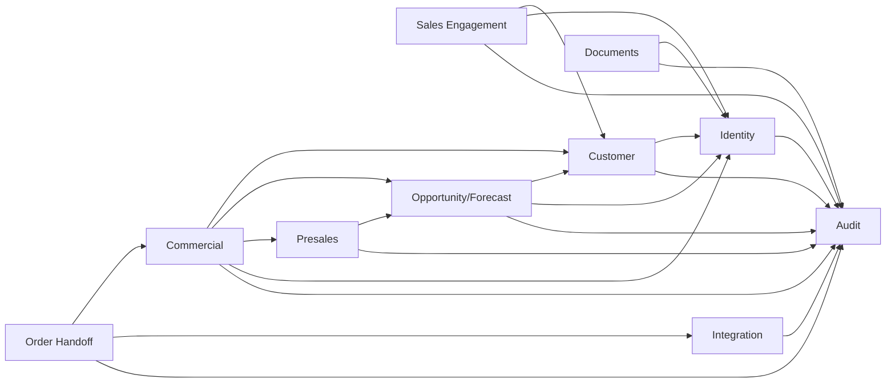

# NTOP Module Boundaries and Dependency Rules

| Metadata | Value |
|---|---|
| Status | In Review |
| Version | 0.1 |
| Owner | Application Architecture |
| Requirements | BR-001–BR-005, SEC-002, NFR-004 |
| Related | [ADR-001](adrs/ADR-001-modular-monolith.md), [Domain Model](../domain-model.md) |

## Modules and ownership

| Module | Owns | May depend on |
|---|---|---|
| Identity | users, sessions, role assignments, auth provider | Audit |
| Customer | customer identity, hierarchy, contacts, ownership | Identity, Audit |
| Sales Engagement | leads, activities, conversion orchestration | Customer, Identity, Audit |
| Opportunity/Forecast | opportunities, stage history, snapshots | Customer, Identity, Audit |
| Presales | product, coverage, solution versions | Opportunity, Audit |
| Commercial | quotes, policy, approvals | Customer, Opportunity, Presales, Identity, Audit |
| Order Handoff | internal orders, handoff packages/references | Commercial, Integration, Audit |
| Documents | metadata, object lifecycle/access | Identity, Audit |
| Integration | adapters, outbox/inbox, reconciliation | module public events/contracts, Audit |
| Audit | append-only evidence | Identity subject reference only |
| Administration | reference/configuration workflows | public admin interfaces only |

## Rules

- Module imports only from another module's `public` contract; no internal domain/persistence imports
- Only owning module writes its tables; foreign IDs are references, not permission grants
- Cross-module read uses query/application interface; reporting uses governed projections
- Cross-module strong transaction requires explicit orchestration owner and ADR/review
- Events contain IDs/facts, not mutable domain objects or secret fields
- Audit is append-only sink; Audit must not call business modules during command transaction
- Circular dependencies are prohibited; resolve with orchestration/event or boundary redesign

## Enforcement and exceptions

- CI dependency graph/import rules; architecture tests map table/repository ownership
- Code review template requires module/API/data/permission impact
- Exception includes owner, rationale, expiry and removal story; Architecture Board approves
- Acceptance: no unowned table, no direct cross-module write and no circular dependency

