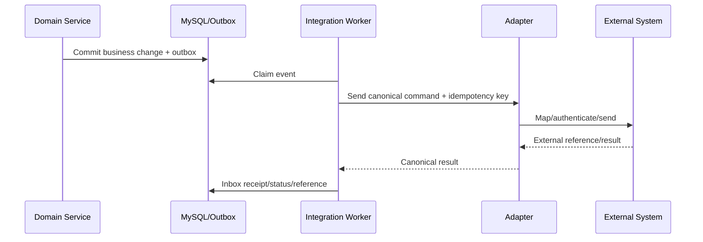

# NTOP Integration Design

| Metadata | Value |
|---|---|
| Status | Approved Baseline |
| Version | 1.0 |
| Owner | Integration Architecture |
| Reviewers | System Owners, Data Governance, Security, Operations, Product, QA |
| Last Updated | 2026-07-11 |
| Related Documents | [Requirements](product-requirements.md), [Architecture](system-architecture.md), [API](api-design.md), [Database](database-design.md), [Testing](testing-strategy.md) |
| Assumptions | Adapter-first; no live integrations in year one; manual handoff mandatory |
| Open Decisions | Future live-integration selection, field-level source of truth, protocols/authentication, SLAs and named operational owners require a later Steering decision |

## 1. Principles

- ไม่มี live integration จน contract, authentication, data owner, operations owner และ reconciliation method ได้รับอนุมัติ (INT-002)
- Domain ไม่เรียก vendor/system-specific client โดยตรง; ใช้ adapter port และ canonical contract
- Command delivery อย่างน้อย once + idempotent consumer; ไม่อ้าง exactly-once ข้ามระบบ
- Asynchronous by default สำหรับ handoff/sync; synchronous เฉพาะ user ต้องได้ immediate validation และ dependency มี SLA
- ทุก critical flow มี manual fallback และ recovery/reconcile (BR-005)

## 2. Approved year-one integration posture

No external system is live-integrated in year one. NTOP builds canonical adapter contracts, outbox/inbox, idempotency and reconciliation foundations while OM, CRM, Billing and Coverage/GIS use versioned manual handoff packages with checksum, external reference and maker-checker. UI/reporting must not claim synchronized or integrated status. Future live integration requires the contract approval checklist and a new Steering decision (OD-004).

## 3. Future source-of-truth hypothesis

| Data area | Draft authority | NTOP role | Direction | Status |
|---|---|---|---|---|
| Sales customer context | Open Decision: CRM/master | consume/cache + sales extensions | inbound/bidirectional by contract | Not approved |
| Opportunity/forecast | NTOP | authoritative sales workflow | outbound summary | Draft |
| Coverage/network facts | GIS/Network Inventory | request + snapshot result | bidirectional | Not approved |
| Quote/approval | NTOP/approved commercial owner | authoritative workflow | outbound | Draft |
| Internal order/provisioning | OM | handoff + status/reference | bidirectional | Not approved |
| Billing references | Billing | reference/read summary | inbound | Not approved |
| Documents | Approved DMS/Object store | metadata/reference | bidirectional | Not approved |
| Identity | Local initially; Corporate IdP future | authenticate/map subject | inbound | Draft |

ตารางนี้เป็น hypothesis; ห้ามใช้ตัดสิน field overwrite จน OD-004 sign-off

## 4. Adapter contract

Adapter ต้อง expose capability/version, submit/fetch/poll หรือ consume event, health, idempotency key, external reference, retry classification, reconciliation query และ manual replay การ map canonical↔external แยก version และทดสอบด้วย contract fixtures

## 5. Reliability

- Outbox claimed with lease; inbox unique `(source,eventId)`; business idempotency unique per operation
- Retry exponential backoff + jitter สำหรับ transient error; validation/auth/contract error ไป dead-letter ทันทีพร้อม redacted diagnostic
- Dead-letter replay ต้อง authorized, reasoned, audited และ preserve original payload hash/correlation
- Circuit breaker ลด cascading failure; queue age/depth และ oldest message alert
- Schema/event version compatibility tested ก่อน deploy (INT-003)

## 6. Reconciliation

Scheduled run เทียบ counts, IDs, versions/status และ financial totals ตาม interface เก็บ `runId`, cutoff, source/target totals, mismatches, resolution owner/status Repair ใช้ command ใหม่ ไม่แก้ database ตรง Dashboard แสดง last success, lag, mismatch และ dead letters (INT-004)

## 7. Manual fallback

เมื่อ adapter unavailable:

1. สร้าง versioned handoff package/export ที่ authorized และ checksum
2. Assign manual task + SLA ให้ operational owner
3. บันทึก external receipt/reference ด้วย maker-checker เมื่อ critical
4. Mark record `MANUAL_PENDING/ACKNOWLEDGED`; ไม่ปลอมเป็น integrated success
5. เมื่อระบบกลับมา reconcile ก่อน replay เพื่อป้องกัน duplicate

## 8. Security and privacy

Mutual TLS/OAuth2/service credential ตาม approved system; secrets ใน vault, rotation และ least privilege Allowlist fields และ minimize PII; encrypt payload/storage; redact logs; verify webhook signature/replay window; export expiry/download audit (SEC-003)

## 9. Contract approval checklist

- Named business/data/technical/operations owners
- Purpose, source of truth และ field ownership
- Endpoint/event schema + version/deprecation
- Identity, authorization, encryption และ data classification
- Volume, latency, availability, rate limit และ maintenance window
- Idempotency, ordering, retry, timeout, DLQ และ replay
- Reconciliation, manual fallback, support/escalation และ test environment
- Security/architecture/data governance sign-off

## 10. Acceptance scenarios

Duplicate/out-of-order event, timeout after external success, invalid payload, expired credential, rate limit, prolonged outage, DLQ replay, mismatch reconciliation และ manual fallback ต้องผ่านโดยไม่สร้าง duplicate business effect หรือสูญ audit trail
