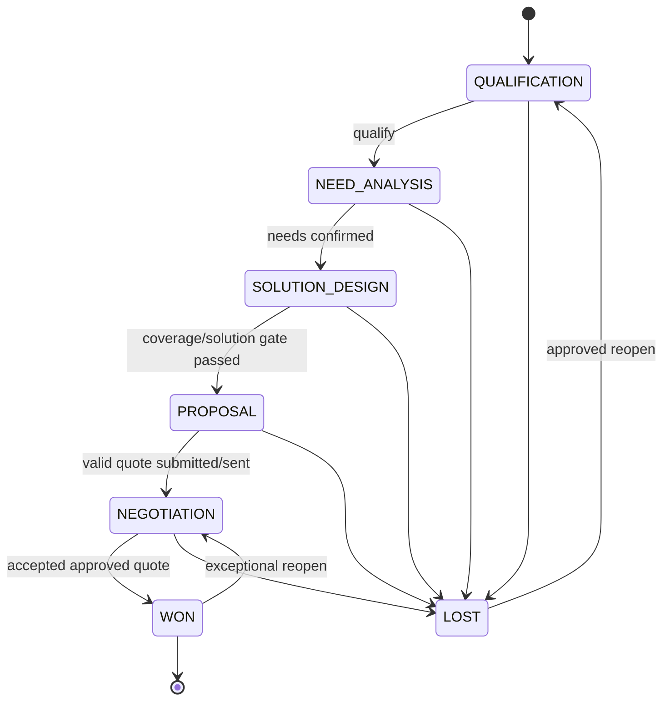

# NTOP Opportunity Workflow

| Metadata | Value |
|---|---|
| Status | Draft for Review |
| Version | 0.1 |
| Owner | Sales Director / Sales Operations |
| Reviewers | KAM, Team Manager, Presales, Coverage, Pricing, Order Operations, Audit, QA |
| Last Updated | 2026-07-11 |
| Related Documents | [Requirements](product-requirements.md), [Domain](domain-model.md), [Permissions](roles-and-permissions.md), [Approval](approval-workflow.md), [Forecast](sales-forecast-design.md) |
| Assumptions | Canonical stages ใช้ชื่อด้านล่าง; transition enforce server-side |
| Open Decisions | Stage probability defaults; stale-day thresholds by segment; reopen authority; mandatory document checklist |

## 1. Entry prerequisites

Opportunity สร้างจาก qualified Lead หรือโดย KAM/Manager ที่มีสิทธิ์ ต้องมี Customer, owner, organization unit, name, flow, initial estimated value/currency, expected close date และ source Lead conversion ต้อง idempotent และ resolve duplicate candidates ก่อน (FR-002, FR-004)

## 2. State model

`CANCELLED` เป็น terminal administrative status แยกจาก `LOST` และใช้เมื่อ duplicate/invalid/created-in-error เท่านั้น พร้อม reason; ไม่รวมใน win-rate denominator ตาม forecast policy

## 3. Transition matrix

| From → To | Minimum exit/entry criteria | Actor | Audit/event |
|---|---|---|---|
| New → Qualification | required entry fields, owner active | KAM/Manager | OpportunityCreated |
| Qualification → Need Analysis | qualification result, customer need, next action | owner/Manager | StageChanged |
| Need Analysis → Solution Design | requirements, stakeholders, value/close date reviewed | owner/Manager | StageChanged |
| Solution Design → Proposal | coverage result where required; solution version; cost/risk complete | owner with Presales/Coverage evidence | StageChanged |
| Proposal → Negotiation | valid quote version submitted/sent; approval complete when required | owner/Manager | StageChanged |
| Negotiation → Won | accepted quote, required approval, PO/acceptance evidence or exception | Manager/Sales Director policy | OpportunityWon |
| Active → Lost | lost reason/category, competitor where known, close date | owner/Manager | OpportunityLost |
| Lost → Qualification | reopen reason, new close date, approval | Manager/Sales Director | OpportunityReopened |
| Won → Negotiation | exceptional correction, no completed order conflict, approval | Sales Director + Audit notification | OpportunityReopened |
| Active → Cancelled | duplicate/invalid reason and authority | Manager | OpportunityCancelled |

ย้อน stage ปกติอนุญาตผ่าน `return` command พร้อม reason และ invalidate downstream draft assumptions; ห้ามแก้ stage field โดยตรง (FR-004, COMP-001)

## 4. Gates and dependencies

- Coverage required เมื่อ product/site policy ระบุ; result ต้องไม่ expired
- Solution version ต้องอ้าง coverage/cost assumptions ที่ใช้
- Quote version ต้องอ้าง solution/coverage versions; change หลัง submit สร้าง quote version ใหม่
- Proposal/Negotiation ไม่เท่ากับ approval; commercial gate ใช้ [approval-workflow.md](approval-workflow.md)
- Won ต้องสร้าง Internal Order จาก accepted approved quote เท่านั้น เว้น policy exception ที่มี authority/audit (FR-005–FR-008)

## 5. Ownership, dates and exceptions

- Reassignment เก็บ effective history, reason และ target manager scope; open tasks reassigned/explicitly retained
- Expected close date เปลี่ยนหลัง Proposal ต้องมี reason; repeated slippage สร้าง risk signal
- Opportunity ไม่มี next action หรือ stage aging เกิน threshold ถูก mark stale และ escalated ไม่ auto-close
- Lost reason immutable หลัง reporting snapshot; correction ทำ audited amendment
- Reopen สร้าง forecast history ใหม่ แต่ snapshot เดิมไม่เปลี่ยน (DATA-004)

## 6. Required audit

ทุก transition เก็บ from/to, aggregate version, actor/role/scope, timestamp, reason, required evidence IDs, policy version, correlation ID และ before/after key fields Event publish หลัง commit ผ่าน outbox

## 7. Acceptance scenarios

- KAM ข้าม Need Analysis ไป Proposal ถูก deny
- Proposal ถูก deny เมื่อ mandatory coverage/solution ไม่ complete
- Stale version transition คืน 409 และไม่ append history
- Unauthorized cross-team transition ไม่เปิดเผย record
- Won ถูก deny เมื่อ quote ยังไม่ accepted/approved
- Lost→reopen เก็บ snapshot/history เดิมและ risk signal ถูกคำนวณใหม่
- Duplicate retry ด้วย idempotency key สร้าง transition ครั้งเดียว

