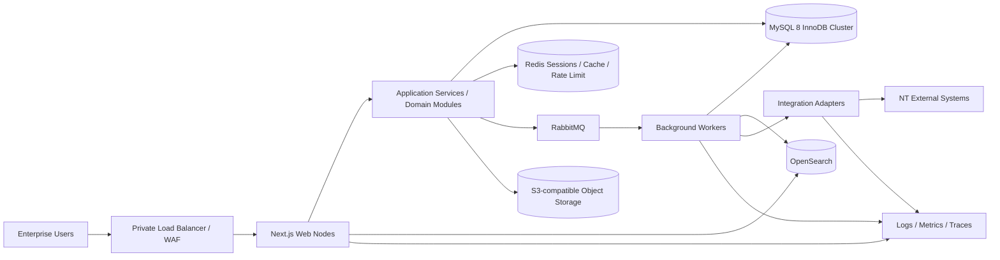
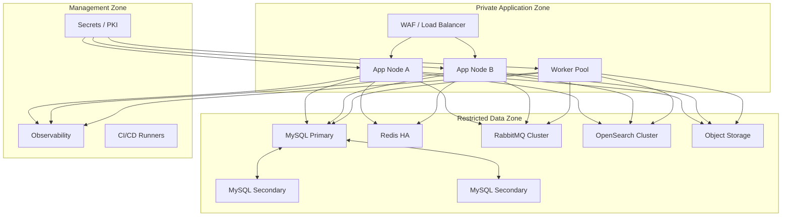

# NTOP System Architecture

| Metadata | Value |
|---|---|
| Status | Draft for Review |
| Version | 0.1 |
| Owner | Enterprise Architecture |
| Reviewers | Product, Security, Data Architecture, Integration, IT Operations, QA |
| Last Updated | 2026-07-11 |
| Related Documents | [Requirements](product-requirements.md), [Domain](domain-model.md), [Database](database-design.md), [API](api-design.md), [Integration](integration-design.md), [Testing](testing-strategy.md) |
| Assumptions | Private cloud; MySQL 8 InnoDB Cluster; 100 concurrent users; modular monolith first |
| Open Decisions | Private-cloud products/SKUs; Kubernetes vs VM platform; search and queue product approval; DR site topology |

## 1. Current-state assessment

ปัจจุบันเป็น Next.js/Prisma CRUD prototype บน MariaDB 5.5 มี server actions และ role แบบกว้าง เหมาะสำหรับพิสูจน์ UX/domain เบื้องต้น แต่ยังไม่มี bounded modules, scalable query model, background processing, fine-grained authorization, immutable audit, HA/DR และ production observability จึงห้ามยก prototype database/deployment เป็น production baseline โดยตรง (BR-001–BR-005, R-01–R-05)

## 2. Architecture principles

- Modular monolith ก่อน microservices เพื่อลด distributed complexity แต่ enforce dependency boundaries ด้วย module APIs/events
- MySQL เป็น transactional source of truth; OpenSearch เป็น rebuildable read projection (DATA-002)
- Stateless web/application instances; session และ shared state อยู่นอก process
- Long-running work ทำผ่าน RabbitMQ workers (OPS-002)
- All authorization และ workflow invariants enforce ฝั่ง server (SEC-002)
- Transactional outbox/inbox สำหรับ reliable events (INT-003)
- API-first application services: UI และ integrations ใช้ policy/validation ชุดเดียวกัน (NFR-004)

## 3. Logical architecture

### Module boundaries

Identity, Customer, Lead/Activity, Opportunity/Forecast, Product, Coverage/Solution, Quote/Approval, Order Handoff, Document, Notification, Integration, Audit และ Administration แต่ละ module เป็นเจ้าของ schema/API ภายในของตน ห้าม module อื่นเขียนตารางโดยตรง; cross-module consistency ใช้ application orchestration หรือ domain event

## 4. Deployment topology

- อย่างน้อย 2 app nodes และ health-based routing; worker scale แยกจาก web
- MySQL 3 members ใน failure domains ต่างกัน; Router/ProxySQL ตาม approved platform
- Search/queue/cache ใช้ HA topology และ resource quotas แยก workload
- Network deny-by-default; administration ผ่าน management zone และ audited bastion
- DR มี encrypted backups นอก primary failure domain; RPO ≤15m/RTO ≤4h ยังเป็น OD-005

## 5. Data flow and consistency

คำสั่งหนึ่ง transaction เขียน aggregate + audit record + outbox event พร้อมกัน Worker publish/process event ด้วย idempotency key; consumer เก็บ inbox receipt ก่อน business effect OpenSearch lag แสดงเป็น freshness indicator และ rebuild ได้จาก MySQL Bulk jobs ใช้ staging/checkpoints ไม่เปิด transaction ยาว (DATA-002, DATA-003, INT-003)

## 6. Security and observability

- TLS ทุก hop, encryption at rest, approved vault และ rotation (SEC-003)
- Local identity + privileged MFA, scoped authorization และ append-only audit (SEC-001, SEC-002, COMP-001)
- Structured log ห้ามมี password/token/PII ที่ไม่จำเป็น; ทุก request/job มี correlation ID
- RED metrics สำหรับ API, queue depth/age, outbox lag, search indexing lag, DB saturation, adapter errors และ reconciliation mismatch
- SLO dashboard, alert routing, runbook link และ incident severity ต่อ signal (OPS-001, OPS-004)

## 7. Scaling and degradation

- Cursor pagination และ query allowlist; ห้าม offset scan ขนาดใหญ่
- Search อ่าน OpenSearch; exact transactional lookup อ่าน MySQL index
- Export/import/report ทำ async และจำกัด concurrency
- หาก OpenSearch ล่ม exact lookup ยังใช้ได้; หาก integration ล่มสร้าง handoff task/manual package; หาก queue backlog สูงระบบรับ command ได้แต่แสดง delayed status
- Capacity test ใช้ 2.5M customers, 100 concurrent + 30% headroom (NFR-001–NFR-003)

## 8. Architecture decision log

| ADR | Decision | Rationale | Rejected alternative |
|---|---|---|---|
| ADR-001 | Modular monolith | domain ยังเปลี่ยนและทีมต้องส่งมอบใน 12 เดือน | microservices ตั้งแต่วันแรกเพิ่ม deployment/consistency burden |
| ADR-002 | MySQL 8 InnoDB Cluster production | HA, supported migrations และ compatibility กับ relational model | MariaDB 5.5 unsupported; NDB semantics ไม่เหมาะโดยยังไม่มี benchmark |
| ADR-003 | OpenSearch projection | full-text/faceted search ที่ 2M+ records | client-side filtering; DB wildcard scans |
| ADR-004 | RabbitMQ + outbox/inbox | reliable background/integration processing | in-process jobs และ dual writes |
| ADR-005 | Redis shared session/cache | stateless app scaling และ rate limits | memory-only sessions |
| ADR-006 | S3-compatible document storage | lifecycle, scale และ malware-scan flow | database BLOB/local disk |
| ADR-007 | REST `/api/v1` | interoperability และ simpler governance | UI-only server actions; GraphQL before use cases justify it |

## 9. Architecture gates

ก่อน implementation ต้องอนุมัติ module boundaries, product SKUs, network diagram, HA/DR topology, threat model และ capacity model; ก่อน production ต้องผ่าน NFR/SEC/OPS tests ที่ระบุใน [testing-strategy.md](testing-strategy.md)

